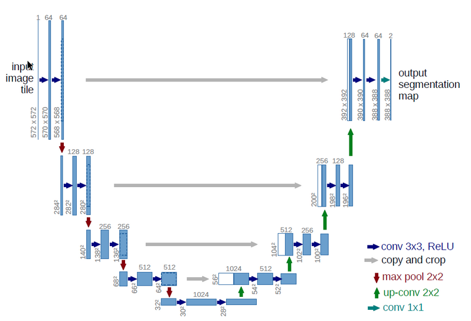

# 重点（个人理解）
## Unet
### 网络结构

U-Net整体的流程是编码和解码（encoder-decoder）。左半部分是encoder，
和vgg类似用于特征提取。右半部分是decoder，使用上采样扩展特征向量。由于整个
网络结构像字母U，所以叫Unet
### 特点
1. 降采样可以增强网络的泛化能力，当输入有小的平移或者旋转时仍有较高准确度。
上采样可以将高度抽象的特征向量还原到原图尺寸用于分割。
2. 将分割问题转化为分类问题：经过vgg网络提取出高度抽象的特征，上采样之后回到原图大小，
对每个像素做分类。
3. 拷贝原内容信息：如果只将上采样后的特征做预测明显会丢失大量信息。层数越浅，内容越多。
为了在深层特征中增加内容信息，做了此拷贝操作。